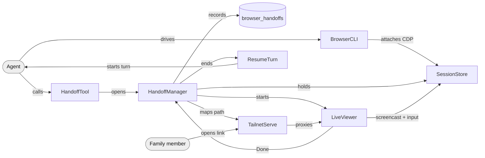

# Design: browser handoff to a human

Status: built 2026-10-04 (shell branch `browser-handoff`, shell-browser branch `browser-handoff`). The phone end-to-end check (§8, third item) is still to do.

## 1. Intent

Unstick agents at human steps

## 2. Decisions

- **CDP screencast viewer over noVNC/neko/KasmVNC**: the host is a Mac with no X server, and VNC on macOS shares the whole desktop. A screencast shows only the tab, stays in Go and reuses chromedp[^E3][^E4].
- **Detached per-session Chrome over a Chrome per CLI run**: today Chrome dies when the command returns, but a handoff needs the same tab to outlive the agent's turn[^E1]. Chrome is not owned by the daemon either, so the CLI works on its own and a session survives a daemon restart.
- **Tailscale `serve` over a cloudflared quick tunnel**: the link cannot be opened from outside the tailnet, while a quick-tunnel URL is public (owner decision)[^E5]. Recipients need to be on the tailnet; the owner will invite them.
- **Headful over headless**: captchas penalise headless Chrome (assumption; the owner accepts a visible window). One data point: a remote tap passed reCAPTCHA's checkbox without a challenge[^E10].
- **Resume as a new turn over holding the turn open**: a human may take minutes. A turn kept open blocks the chat, and mid-turn injection refuses unless a turn is in flight[^E6].
- **Handoff is the agent's call, not a last resort** (owner direction, 2026-10-05): besides steps only a person can do, the agent hands the tab over to show a find, to let someone check and finish, or when it has gone as far as it can. Done carries an optional note back, and the resume turn reports what happened without assuming a blocked step.
- **The agent writes the chat message; the daemon posts it**: the wording stays with the agent and in the chat's language. Posting immediately, rather than in the agent's reply, also works mid-turn for watch mode.

## 3. Components

- **BrowserCLI**: the browser skill; `--session` reuses a tab, `-` stays on the page
- **SessionStore**: one detached Chrome per session dir, with a human-hold lock
- **HandoffTool**: MCP tool `shell_browser`, which backs `POST /browser`
- **HandoffManager**: owns a handoff's row, view, link, hold and timer
- **LiveViewer**: streams screencast frames and replays a person's input
- **TailnetServe**: publishes LiveViewer at `/h/<token>`, tailnet only
- **ResumeTurn**: runs the agent's next turn when the handoff ends

## 4. Data flow

1. The agent drives BrowserCLI with `--session trip`. SessionStore starts Chrome on first use under the agent's own sessions dir, and BrowserCLI attaches over CDP[^E2].
2. The agent hits a captcha and calls HandoffTool with a reason and a message. SHELL_CHAT_ID and SHELL_MESSAGE_THREAD_ID identify the chat; a lane thread is mapped to the real thread[^E7].
3. HandoffManager records a row, starts LiveViewer on a loopback port and has TailnetServe map `/h/<token>` to it[^E5].
4. HandoffManager posts the agent's message with a link button to the chat and thread (Telegram or Discord), then holds the session. While it is held, BrowserCLI exits 3.
5. The agent ends its turn.
6. A family member opens the link. LiveViewer streams frames and replays taps, swipes, text, keys and address-bar navigation into the tab. A tab the page opens is followed.
7. The person taps Done, or the TTL lapses. HandoffManager ends the row once, closes the view, unpublishes the path and releases the hold.
8. ResumeTurn runs `[Browser handoff #N done: … now at <url> …]` in the same chat and thread, and the agent continues with `browser --session trip -`[^E9].

## 5. Data model

| thing | why |
|---|---|
| `browser_handoffs` (id, session, mode handoff/watch, chat_id, thread_id (real), reason, path, link, status open/done/expired/cancelled/failed, final_url, ended_by, note, expires_at, ended_at) in each agent's shell.db | Recover re-serves an open row at the SAME path after a restart, so the link already in the chat keeps working. `EndBrowserHandoff` only moves rows out of open, so Done and expiry cannot both resume. The path is stored as-is: tailscale's own serve config holds it anyway |
| `<agent dir>/browser-sessions/<name>/` (profile/, target, lock.json, last_used, chrome.log) | Chrome locks its user-data-dir, so agents must not share one (they did before[^E2]). The CLI finds it through SHELL_BROWSER_SESSIONS |
| `lock.json` {handoff_id, expires_at} | lets the CLI refuse while a person drives. An expired lock no longer holds, so a dead daemon cannot wedge the agent |

## 6. Interfaces

- **BrowserCLI** `browser --session <name> <url|-> [action…]` behaves as before; `-` stays on the current page. Exit 3 means the session is held by a person; wait for the resume turn. Also `--list-sessions`, `--session x --close-session`, and `--serve-live <addr>` (a standalone viewer for debugging).
- **HandoffTool** `shell_browser(action="handoff"|"watch", session, reason, message?, ttl_min?)` returns text naming #N, the link and expiry, and for a handoff tells the agent to end its turn. `action="status"`, and `action="cancel", id` (no resume). Errors: not enabled (503), session already has a view (409, names it), session not running, tailscale serve disabled, no chat.
- **LiveViewer** (relative to `/h/<token>/`): `GET ./`, `GET ./events` (SSE `frame`, `state`, `ended`), `POST ./input` and `POST ./done` (`{"note": "…"}`, optional, ≤2000 chars). Input and Done accept JSON only (415 otherwise, so cross-site forms are blocked), are refused in watch mode (403), and address-bar URLs go through the browser domain policy (403). Several viewers may watch at once. An unknown token is a 404 from tailscale serve.
- **ResumeTurn** sends `[Browser handoff #N done|expired|stopped …]` with sender `browser-handoff`: who tapped Done, their note, where the tab is, and why it was shared; the agent decides what follows (continue, answer, or nothing). Expired is a normal outcome. Cancel and watch views never resume.

## 7. Plan

0. Spike [DONE]: visible Chrome from a non-console process plus a screencast frame[^E8]; tailscale serve at a path, tailnet only[^E5].
1. **SessionStore** [NEW] shell-browser `session/`: detached launch with `--remote-debugging-port=0`, `--use-mock-keychain`, tab selection, hold lock, Attach without closing the tab[^E11].
2. **BrowserCLI** [CHANGE] shell-browser `cmd/shell-browser` gains `--session`, `-`, list/close; `make skills` now builds THIS CLI. The old shell wrapper ignored every documented flag[^E12].
3. **LiveViewer** [NEW] shell-browser `liveview/`: SSE frames (max ~10/s per viewer), taps glide the pointer in, plus a text box, keys, address bar and Done.
4. **TailnetServe** [NEW] `internal/browserhandoff/tailscale.go`.
5. **HandoffManager** [NEW] `internal/browserhandoff/manager.go`: open, finish once, Recover, Shutdown (keeps paths), idle reaper.
6. **HandoffTool** [NEW] MCP tool, `POST /browser`, the `browser_handoffs` table, `browser` config, SHELL_BROWSER_SESSIONS in the child env.
7. **ResumeTurn** [NEW] `internal/daemon/browserhandoff.go`: `syntheticTurn`, delivered like an A2A turn[^E9].
8. Docs [CHANGE]: browser SKILL.md, ARCHITECTURE.md, CLAUDE.md.

## 8. Done

- Both repos' tests pass. · proof: `go test ./...` in `shell` and `../shell-browser` → `ok` for every package, exit 0 · invariant: `make verify-no-pii` passes.
- The link reaches the tailnet only. · proof: with a handoff open, `curl -s -o /dev/null -w '%{http_code}' <link>` from the mini → `200`; an unknown token at the same host → `404`; `tailscale serve status` lists `/h/<token>`, and after Done it no longer does · invariant: `tailscale funnel status` shows nothing public, and no cloudflared process is started.
- A human solve resumes the agent in the same tab. · proof: the agent opens `https://www.google.com/recaptcha/api2/demo` in a session and calls handoff. The owner solves it on a phone and taps Done. A `[Browser handoff #N done …]` turn appears in the chat, and the agent's next `browser --session … -` sees "Verification Success" · invariant: the row reads `status=done`.
- Expiry cleans up. · proof: a handoff with `ttl_min=1`, left alone, gives `status=expired`, the path is gone and a resume turn says "expired" · invariant: the session's Chrome is still running.

---

## Evidence

[^E1]: Each CLI run built a fresh exec allocator, so Chrome lived only as long as the command · shell-browser `internal/browser/browser.go` at d0a9989, lines 146-180 (`chromedp.NewExecAllocator` … `defer allocCancel()`).
[^E2]: Profiles lived in one dir shared by both agents · shell-browser `browser.go:41-43,99-108` (`~/.shell/browser-profiles/<name>`). Both daemons run as the same macOS user (`ps -ax | grep 'shell daemon'` → one pid per agent config, ppid 1).
[^E3]: The pinned cdproto has the screencast and input APIs · `grep -l "StartScreencast\|DispatchTouchEvent\|InsertText" $(go env GOMODCACHE)/github.com/chromedp/cdproto@v0.0.0-20250724212937-08a3db8b4327/{page/page.go,input/input.go}` → both files match.
[^E4]: Alternatives, for the record: noVNC needs a VNC server (macOS Screen Sharing exposes the whole desktop and login); neko (WebRTC) and KasmVNC are the modern noVNC successors but need Linux or Docker with an X server. Hosted "live view" products (Browserbase, Steel) use the same CDP screencast approach.
[^E5]: Tailscale serve, run 2026-10-04. Before the owner enabled anything: `tailscale serve --bg --yes --set-path /h/spike http://127.0.0.1:18765` → `Serve is not enabled on your tailnet. To enable, visit: https://login.tailscale.com/f/serve?node=…` and it blocks waiting; `tailscale status --json` → `CertDomains: null`, `MagicDNSEnabled: false`. After the owner enabled MagicDNS, HTTPS certificates and Serve, the same command → `Available within your tailnet: https://<mini>.<tailnet>.ts.net/h/spike`, exit 0; `serve status` → `(tailnet only)`; `curl https://<mini>.<tailnet>.ts.net/h/spike/` → `handoff-spike-ok`, `http=200 ssl_verify=0`; an unmapped path → 404; `tailscale serve --https=443 --set-path /h/spike off` → `No serve config`. serve strips the path prefix when proxying, so the viewer uses relative URLs and links end in `/`. The CLI 1.102 / daemon 1.94 version mismatch did not matter.
[^E6]: Mid-turn injection only absorbs into an in-flight turn and refuses otherwise · `internal/bridge/absorb.go:21-35` (`InjectFollowUp`, `process.ErrInject*`).
[^E7]: The Claude subprocess gets the chat and the session thread · `internal/process/persistent.go:373-376`, `manager.go:358-361` (`SHELL_CHAT_ID`, `SHELL_MESSAGE_THREAD_ID`). In a lane chat the thread is a negative synthetic id, so `POST /browser` maps it with `store.RealThread` (`internal/store/route.go:290`). (An earlier draft said the thread was missing; that was wrong.)
[^E8]: Visible Chrome 154 from a non-console context (an ssh session; the daemons are ppid-1 processes, not LaunchAgents): `Google Chrome --user-data-dir=… --remote-debugging-port=0 about:blank` → `DevToolsActivePort` written, `/json/version` answers, and a page target is listed. The log shows `Encryption is not available` (no Keychain access) → sessions pass `--use-mock-keychain --password-store=basic` so cookies persist. The screencast produced 1280×813 JPEG frames of a headful tab.
[^E9]: Scheduler prompts carry no thread · `internal/scheduler/scheduler.go:90` (`type PromptFunc func(ctx, chatID int64, msg string) error`). The A2A peer turn already does (chat, thread, prompt) → turn → delivery on the routed outbound, with busy-session retries · `internal/daemon/daemon.go` A2A block (`syntheticTurn(…, pl.ChatID, pl.ThreadID, …)` then `bot.SendText(pl.ChatID, pl.ThreadID, …)`). ResumeTurn copies it. A prompt starting with `[` skips lane routing, so the resume lands in the chat/thread's general session.
[^E10]: Local end-to-end, shell-browser `--serve-live`, 2026-10-04: navigate via `POST /input {"t":"nav"}` to the reCAPTCHA demo → tap the checkbox at (0.0469, 0.4588) → the frame shows a green check with no image challenge → `POST /done` → `browser --session smoke - 'click "#recaptcha-demo-submit"' text` → `Verification Success... Hooray!`. `nav` to `http://127.0.0.1:22/` → 403 (policy); a form-encoded post → 415.
[^E11]: chromedp v0.14.2 forces `first=false` for every context on a RemoteAllocator (`chromedp.go` NewContext), so cancelling one sends `Target.closeTarget`. Seen in practice: before the fix, `--list-sessions` showed `0 tab(s)` after a run. `session.Attach`'s release clears `Context.Target` before cancelling; afterwards the second run reports `stay on current page: https://example.com/`.
[^E12]: The shell Makefile built `skills/browser/scripts/browser` from shell's own `cmd/shell-browser`, a 73-line wrapper with no flag parsing: `~/.shell/skills/browser/scripts/browser --profile x https://example.com text` → `navigate "--profile": … has no scheme or host`. The installed SKILL.md documents the shell-browser CLI (`--profile`, `--allow-js`, refs). `make skills` now builds `github.com/rcliao/shell-browser/cmd/shell-browser`.
